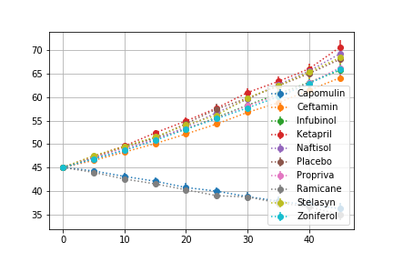
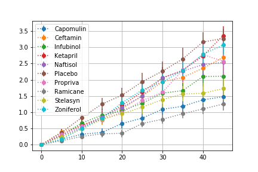
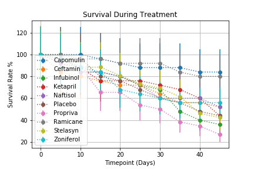
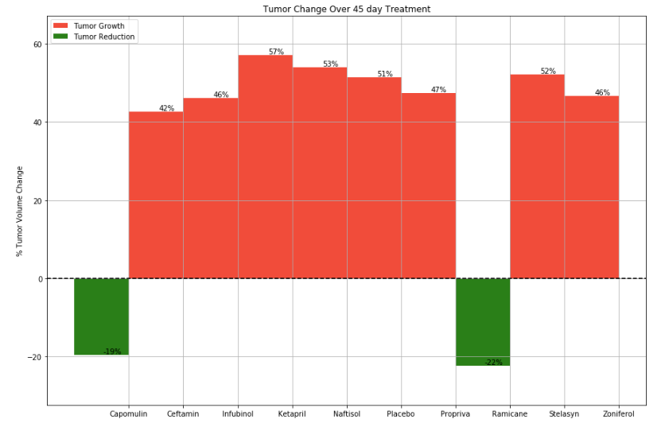
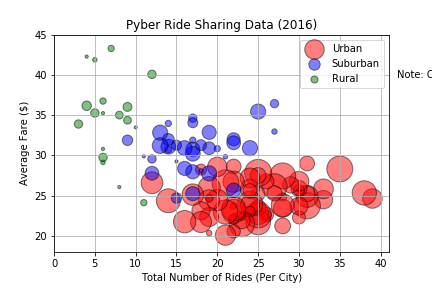
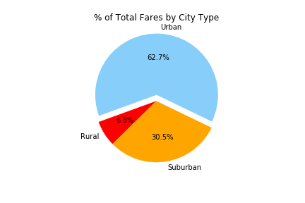
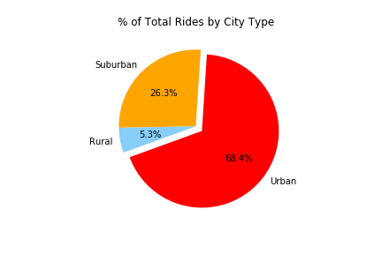
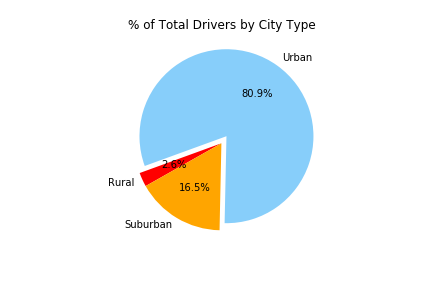

# Pymaceuticals Inc

### Analysis

- Capomulin outformed the Infubinol, Ketapril, and the placebo in tumor volume reduction, survival rate, and lower metastatic site occurrences.  It was the only treatment out of the 4 reported that saw average tumor size consistently decrease over the 45 day treatment and average tumor size decrease overall.  The average number of metastatic sites was nearly 1.75 sites lower than the placebo group and the Ketapril group.  Capomulin also saw significantly higher survival rates over the course of the 45 days.  They were the only group with a final survival rate of over 50% and a survival rate 37.5% higher than any other group.  
- Ketapril seems to have a positive affect on tumor volume with the tumors seeing slightly greater average growth over the 45 day time span than the placebo group.  The Ketapril group saw an average growth of about 5.7% higher than the placebo group.  This may or may not be statistically significant.  The Ketapril group saw a slower average increase in metastatic sites than the Placebo group during the course of the 45 days, but overall the number of metatastic sites were about the same.  Ketapril's survival rates are comparable to the placebo at the end of the 45 day treatment. 
- The average Infubinal group tumor growth was similar to that of the placebo group, but the average increase metastatic sites was lower over the course of treatment and overall.  This group still experienced average growth in metastatic sites higher than Capomulin.  The Infubinal group, however, experienced the lowest survival rates of the two other treatments and the placebo.     


## Tumor Volume During Treatment

```python
# Store the Mean Tumor Volume Data Grouped by Drug and Timepoint 
mean = merged.groupby(['Drug','Timepoint'])["Tumor Volume (mm3)"].mean()
# Convert to DataFrame
mean_df=pd.DataFrame(mean).reset_index()
# Store the Standard Error of Tumor Volumes Grouped by Drug and Timepoint
sem = merged.groupby(['Drug','Timepoint'])["Tumor Volume (mm3)"].sem()
# Convert to DataFrame
sem_df=pd.DataFrame(sem).reset_index()
# Minor Data Munging to Re-Format the Data Frames
re_mean = mean_df.pivot(index='Timepoint', columns='Drug')['Tumor Volume (mm3)']
re_sem = sem_df.pivot(index="Timepoint", columns="Drug")["Tumor Volume (mm3)"]

#Generate the Plot (with Error Bars)
fig, ax = plt.subplots()

for column in re_mean:
    ax.errorbar(re_mean.index, re_mean[column], yerr=re_sem[column], fmt='o' ,ls=':')


plt.legend(loc="best")
plt.grid()

```



## Metastatic Data During Treatment

```python
# Store the Mean Met. Site Data Grouped by Drug and Timepoint 
mean_met = merged.groupby(['Drug','Timepoint'])["Metastatic Sites"].mean()
# Convert to DataFrame
met_mean = pd.DataFrame(mean_met)
# Store the Standard Error associated with Met. Sites Grouped by Drug and Timepoint 
sem_met = merged.groupby(['Drug','Timepoint'])["Metastatic Sites"].sem()
# Convert to DataFrame
met_sem = pd.DataFrame(sem_met)
# Minor Data Munging to Re-Format the Data Frames
reset_mean=met_mean.reset_index()
reset_sem=met_sem.reset_index()
meta_mean = reset_mean.pivot(index="Timepoint", columns="Drug")["Metastatic Sites"]
meta_sem = reset_sem.pivot(index="Timepoint", columns="Drug")["Metastatic Sites"]

# Generate the Plot (with Error Bars)
fig, ax = plt.subplots()

for column in re_mean:
    ax.errorbar(meta_mean.index, meta_mean[column], yerr=meta_sem[column], fmt='o' ,ls=':')

plt.legend(loc="best")
plt.grid()
```




## Survival Rate During Treatment 

```python
# Store the Count of Mice Grouped by Drug and Timepoint (W can pass any metric)
mice_count = merged.groupby(['Drug','Timepoint'])["Mouse ID"].count()
# Convert to DataFrame
mice_count_df=pd.DataFrame(mice_count)
mice_count_df=mice_count_df.reset_index()
# Minor Data Munging to Re-Format the Data Frames
mice_count_p = mice_count_df.pivot(index='Timepoint',columns='Drug',values='Mouse ID')

# Generate the Plot (Accounting for percentages)
fig, ax = plt.subplots()

for column in re_mean:
    ax.errorbar(re_mean.index, mice_count_p[column]/mice_count_p[column].max()*100, yerr=mice_count_p[column], fmt='o' ,ls=':')

plt.grid()
plt.legend(loc="best")
plt.title("Survival During Treatment")
plt.xlabel("Timepoint (Days)")
plt.ylabel("Survival Rate %")

```



## Tumor Volume % Change 

```python
# Calculate the percent changes for each drug
drug_list=re_mean.keys()
prc_change=(re_mean.loc[45,drug_list]-re_mean.loc[0,drug_list])/re_mean.loc[0,drug_list]*100

# Store all Relevant Percent Changes into a Tuple
drug_tuple=tuple(drug_list)
prc_change_tuple=tuple(prc_change)
objects = (drug_tuple)
y_pos = np.arange(len(objects))
plt.figure(figsize = (15,10))

# Splice the data between passing and failing drugs
for drug in range(len(drug_list)):
    if prc_change[drug] > 0:
        growth=plt.bar(y_pos[drug], prc_change[drug], color='r', align='edge', alpha=0.8, width=1)
    else:
        reduction=plt.bar(y_pos[drug], prc_change[drug], color='g', align='edge', alpha=1, width=1)
    plt.text(y_pos[drug]+0.7, prc_change[drug], '%d' % int(prc_change[drug])+'%', ha='center', va='bottom', color='black')
    
# Orient widths. Add labels, tick marks, etc. 
plt.grid()
plt.axhline(y=0, color = 'black', linestyle='--')
plt.xticks(y_pos+1, objects)
plt.ylabel('% Tumor Volume Change')
plt.title('Tumor Change Over 45 day Treatment')
plt.legend((growth, reduction), ('Tumor Growth', 'Tumor Reduction'), loc="upper left")
plt.ylim(min(prc_change_tuple)-10,max(prc_change_tuple)+10)
plt.figure(figsize=(100,1))
```




# Pyber Ride Sharing Data

#### Analysis
- Pyber's business is primarily driven by urban locations, with urban cities making up 62% of all fares, 68% of all rides, and 78% of all drivers.
- Urban cities generally have more rides at a lower average fare than suburban and rural locations.
- More rural locations generally have fewer drivers - urban cities tend to have more drivers than suburban cities, which in turn have more drivers than rural cities.

### Data load
```python
# File to Load (Remember to change these)
city_data_to_load = "data/city_data.csv"
ride_data_to_load = "data/ride_data.csv"

# Read the City and Ride Data
city_data = pd.read_csv(city_data_to_load)
ride_data = pd.read_csv(ride_data_to_load)

# Combine the data into a single dataset
merged = pd.merge(city_data, ride_data, on = "city")
```

### Bubble Plot Summary of Data

```python
# Obtain the x and y coordinates for each of the three city types
df = merged.set_index("type")
urban = df.loc["Urban",["city"]]
sub = df.loc["Suburban",["city"]]
rural = df.loc["Rural",["city"]]

#x-axis
x_urban = urban["city"].value_counts()
x_sub = sub["city"].value_counts()
x_rural = rural["city"].value_counts()

#y-axis
y_urban = df.loc["Urban"].groupby("city")["fare"].mean()
y_sub = df.loc["Suburban"].groupby("city")["fare"].mean()
y_rural = df.loc["Rural"].groupby("city")["fare"].mean()

#size of the scatter
s_urban = city_data.loc[city_data["type"]=="Urban","driver_count"]
s_sub = city_data.loc[city_data["type"]=="Suburban","driver_count"]
s_rural = city_data.loc[city_data["type"]=="Rural","driver_count"]

# Build the scatter plots for each city types
plt.scatter(x_urban, y_urban, marker="o", facecolors="red", edgecolors="black", label="Urban", s=s_urban*10, alpha=0.5)
plt.scatter(x_sub, y_sub, marker="o", facecolors="blue", edgecolors="black", label="Suburban", s=s_sub*10, alpha=0.5)
plt.scatter(x_rural, y_rural, marker="o", facecolors="green", edgecolors="black", label="Rural", s=s_rural*10, alpha=0.5)

# Incorporate the other graph properties
plt.grid()
plt.xlim(0, 41)
plt.ylim(18, 45)
plt.title("Pyber Ride Sharing Data (2016)")
plt.xlabel("Total Number of Rides (Per City)")
plt.ylabel("Average Fare ($)")

# Create a legend
plt.legend(loc="best")

# Incorporate a text label regarding circle size
plt.text(58, 40,'Note: Circle size corelates with driver count per city.', horizontalalignment='center', verticalalignment='center')

# Save Figure
plt.savefig("pyber_scatter.png")
```





### Total Fares by City Type


```python
# Calculate Type Percents
total=merged.groupby("type")["fare"].sum()

# Build Pie Chart
labels=total.keys()
colors = ["red", "orange", "lightskyblue"]
explode = (0, 0, 0.1)
plt.pie(total, explode=explode, colors=colors, labels=labels, autopct="%1.1f%%", shadow=False, startangle=200)
plt.title("% of Total Fares by City Type")

# Save Figure
plt.savefig("pyber_pie_fares.png")
```




### Total Rides by City Type


```python

# Calculate Ride Percents
total=merged["type"].value_counts()

# Build Pie Chart
labels=total.keys()
colors = ["red", "orange", "lightskyblue"]
explode = (0.1, 0, 0)
plt.pie(total, explode=explode, colors=colors, labels=labels, autopct="%1.1f%%", shadow=False, startangle=200)
plt.title("% of Total Rides by City Type")

# Save Figure
plt.savefig("pyber_pie_rides.png")
```




### Driver Count by City Type


```python
total=city_data.groupby("type")["driver_count"].sum()

# Build Pie Chart
labels=total.keys()
colors = ["red", "orange", "lightskyblue"]
explode = (0, 0, 0.1)
plt.pie(total, explode=explode, colors=colors, labels=labels, autopct="%1.1f%%", shadow=False, startangle=200)
plt.title("% of Total Drivers by City Type")

# Save Figure
plt.savefig("pyber_pie_drivers.png")
```


