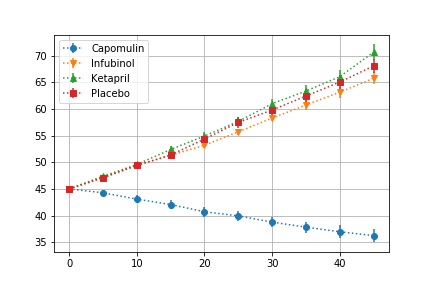
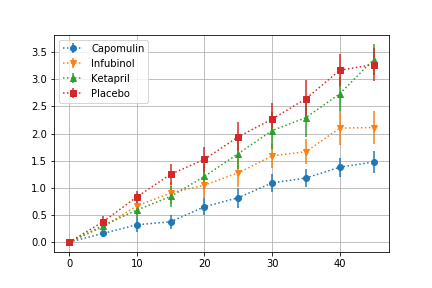
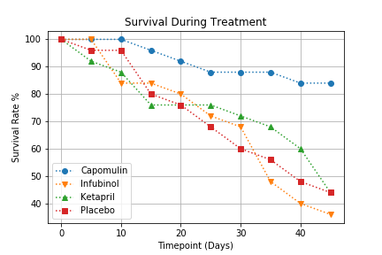
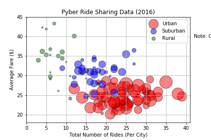
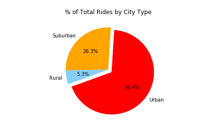
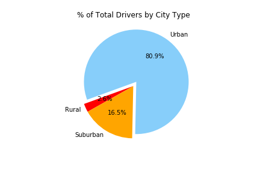

# Pymaceuticals Inc

#### Analysis
- 

### Data load
```python
mouse_drug_data_to_load = "data/mouse_drug_data.csv"
clinical_trial_data_to_load = "data/clinicaltrial_data.csv"

# Read the Mouse and Drug Data and the Clinical Trial Data
mouse_data = pd.read_csv(mouse_drug_data_to_load)
clinical_data = pd.read_csv(clinical_trial_data_to_load)

# Combine the data into a single dataset
merged = pd.merge(mouse_data, clinical_data, on="Mouse ID")
```
### Tumor Response to Treatment

```python
# Store the Mean Tumor Volume Data Grouped by Drug and Timepoint 
mean = merged.groupby(['Drug','Timepoint'])["Tumor Volume (mm3)"].mean()
mean_df=pd.DataFrame(mean).reset_index()

# Store the Standard Error of Tumor Volumes Grouped by Drug and Timepoint
sem = merged.groupby(['Drug','Timepoint'])["Tumor Volume (mm3)"].sem()
sem_df=pd.DataFrame(sem).reset_index()

# Minor Data Munging to Re-Format the Data Frames
re_mean = mean_df.pivot(index='Timepoint', columns='Drug')['Tumor Volume (mm3)']
re_sem = sem_df.pivot(index="Timepoint", columns="Drug")["Tumor Volume (mm3)"]

# Generate the Plot (with Error Bars)
x_axis = merged["Timepoint"].unique()

fig, ax = plt.subplots()
ax.errorbar(x_axis, re_mean["Capomulin"], re_sem["Capomulin"],fmt="o",ls=':')
ax.errorbar(x_axis, re_mean["Infubinol"], re_sem["Infubinol"], fmt="v",ls=':')
ax.errorbar(x_axis, re_mean["Ketapril"], re_sem["Ketapril"], fmt="^",ls=':')
ax.errorbar(x_axis, re_mean["Placebo"], re_sem["Placebo"], fmt="s",ls=':')

plt.legend(loc="best")
plt.grid()
```


### Metastatic Response to Treatment
```python
# Store the Mean Met. Site Data Grouped by Drug and Timepoint 
mean_met = merged.groupby(['Drug','Timepoint'])["Metastatic Sites"].mean()
met_mean = pd.DataFrame(mean_met)

# Store the Standard Error associated with Met. Sites Grouped by Drug and Timepoint 
sem_met = merged.groupby(['Drug','Timepoint'])["Metastatic Sites"].sem()
met_sem = pd.DataFrame(sem_met)

# Minor Data Munging to Re-Format the Data Frames
reset_mean=met_mean.reset_index()
reset_sem=met_sem.reset_index()
re_mean = reset_mean.pivot(index="Timepoint", columns="Drug")["Metastatic Sites"]
re_sem = reset_sem.pivot(index="Timepoint", columns="Drug")["Metastatic Sites"]

# Generate the Plot (with Error Bars)
x_axis = merged["Timepoint"].unique()

fig, ax = plt.subplots()
ax.errorbar(x_axis, re_mean["Capomulin"], re_sem["Capomulin"],fmt="o",ls=':')
ax.errorbar(x_axis, re_mean["Infubinol"], re_sem["Infubinol"], fmt="v",ls=':')
ax.errorbar(x_axis, re_mean["Ketapril"], re_sem["Ketapril"], fmt="^",ls=':')
ax.errorbar(x_axis, re_mean["Placebo"], re_sem["Placebo"], fmt="s",ls=':')

plt.legend(loc="best")
plt.grid()
```



### Survival Rates

```python
# Store the Count of Mice Grouped by Drug and Timepoint (W can pass any metric)
mice_count = merged.groupby(['Drug','Timepoint'])["Mouse ID"].count()
mice_count_df=pd.DataFrame(mice_count)
mice_count_df=mice_count_df.reset_index()

# Minor Data Munging to Re-Format the Data Frames
mice_count_p = mice_count_df.pivot(index='Timepoint',columns='Drug',values='Mouse ID')

# Generate the Plot (Accounting for percentages)
x_axis = merged["Timepoint"].unique()

fig, ax = plt.subplots()
ax.errorbar(x_axis, (mice_count_p["Capomulin"]/mice_count_p["Capomulin"].max()*100),fmt="o",ls=':')
ax.errorbar(x_axis, (mice_count_p["Infubinol"]/mice_count_p["Infubinol"].max()*100),fmt="v",ls=':')
ax.errorbar(x_axis, (mice_count_p["Ketapril"]/mice_count_p["Ketapril"].max()*100),fmt="^",ls=':')
ax.errorbar(x_axis, (mice_count_p["Placebo"]/mice_count_p["Placebo"].max()*100),fmt="s",ls=':')

plt.grid()
plt.legend(loc="best")
plt.title("Survival During Treatment")
plt.xlabel("Timepoint (Days)")
plt.ylabel("Survival Rate %")
```


# Pyber Ride Sharing Data

#### Analysis
- Pyber's business is primarily driven by urban locations, with urban cities making up 62% of all fares, 68% of all rides, and 78% of all drivers.
- Urban cities generally have more rides at a lower average fare than suburban and rural locations.
- More rural locations generally have fewer drivers - urban cities tend to have more drivers than suburban cities, which in turn have more drivers than rural cities.

### Data load
```python
# File to Load (Remember to change these)
city_data_to_load = "data/city_data.csv"
ride_data_to_load = "data/ride_data.csv"

# Read the City and Ride Data
city_data = pd.read_csv(city_data_to_load)
ride_data = pd.read_csv(ride_data_to_load)

# Combine the data into a single dataset
merged = pd.merge(city_data, ride_data, on = "city")
```

### Bubble Plot Summary of Data

```python
# Obtain the x and y coordinates for each of the three city types
df = merged.set_index("type")
urban = df.loc["Urban",["city"]]
sub = df.loc["Suburban",["city"]]
rural = df.loc["Rural",["city"]]

#x-axis
x_urban = urban["city"].value_counts()
x_sub = sub["city"].value_counts()
x_rural = rural["city"].value_counts()

#y-axis
y_urban = df.loc["Urban"].groupby("city")["fare"].mean()
y_sub = df.loc["Suburban"].groupby("city")["fare"].mean()
y_rural = df.loc["Rural"].groupby("city")["fare"].mean()

#size of the scatter
s_urban = city_data.loc[city_data["type"]=="Urban","driver_count"]
s_sub = city_data.loc[city_data["type"]=="Suburban","driver_count"]
s_rural = city_data.loc[city_data["type"]=="Rural","driver_count"]

# Build the scatter plots for each city types
plt.scatter(x_urban, y_urban, marker="o", facecolors="red", edgecolors="black", label="Urban", s=s_urban*10, alpha=0.5)
plt.scatter(x_sub, y_sub, marker="o", facecolors="blue", edgecolors="black", label="Suburban", s=s_sub*10, alpha=0.5)
plt.scatter(x_rural, y_rural, marker="o", facecolors="green", edgecolors="black", label="Rural", s=s_rural*10, alpha=0.5)

# Incorporate the other graph properties
plt.grid()
plt.xlim(0, 41)
plt.ylim(18, 45)
plt.title("Pyber Ride Sharing Data (2016)")
plt.xlabel("Total Number of Rides (Per City)")
plt.ylabel("Average Fare ($)")

# Create a legend
plt.legend(loc="best")

# Incorporate a text label regarding circle size
plt.text(58, 40,'Note: Circle size corelates with driver count per city.', horizontalalignment='center', verticalalignment='center')

# Save Figure
plt.savefig("pyber_scatter.png")
```





### Total Fares by City Type


```python
# Calculate Type Percents
total=merged.groupby("type")["fare"].sum()

# Build Pie Chart
labels=total.keys()
colors = ["red", "orange", "lightskyblue"]
explode = (0, 0, 0.1)
plt.pie(total, explode=explode, colors=colors, labels=labels, autopct="%1.1f%%", shadow=False, startangle=200)
plt.title("% of Total Fares by City Type")

# Save Figure
plt.savefig("pyber_pie_fares.png")
```


### Total Rides by City Type


```python

# Calculate Ride Percents
total=merged["type"].value_counts()

# Build Pie Chart
labels=total.keys()
colors = ["red", "orange", "lightskyblue"]
explode = (0.1, 0, 0)
plt.pie(total, explode=explode, colors=colors, labels=labels, autopct="%1.1f%%", shadow=False, startangle=200)
plt.title("% of Total Rides by City Type")

# Save Figure
plt.savefig("pyber_pie_rides.png")
```




### Driver Count by City Type


```python
total=city_data.groupby("type")["driver_count"].sum()

# Build Pie Chart
labels=total.keys()
colors = ["red", "orange", "lightskyblue"]
explode = (0, 0, 0.1)
plt.pie(total, explode=explode, colors=colors, labels=labels, autopct="%1.1f%%", shadow=False, startangle=200)
plt.title("% of Total Drivers by City Type")

# Save Figure
plt.savefig("pyber_pie_drivers.png")
```


